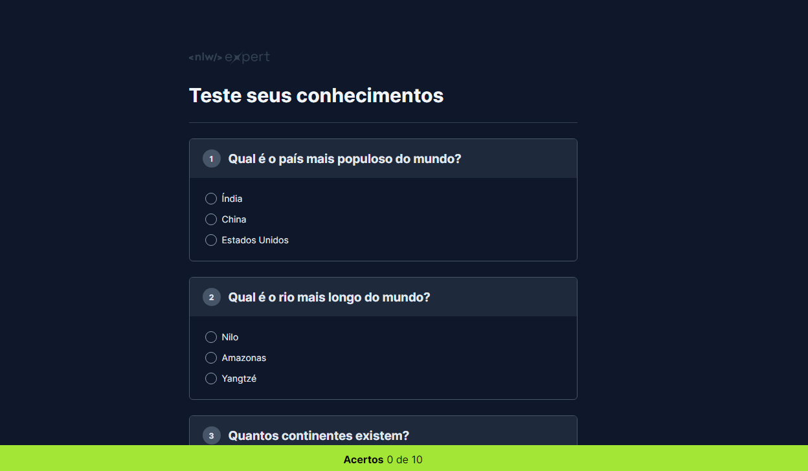

  

## 🚀 Tecnologias

Esse projeto foi desenvolvido com as seguintes tecnologias:

- HTML
- CSS
- JavaScript

## 💻 Projeto

Nesse projeto você vai desenvolver um quiz pra testar os seus conhecimentos técnicos e ter um retorno sobre a quantidade de questões que você acertou.

## 📝 Licença

Esse projeto está sob a licença MIT.
